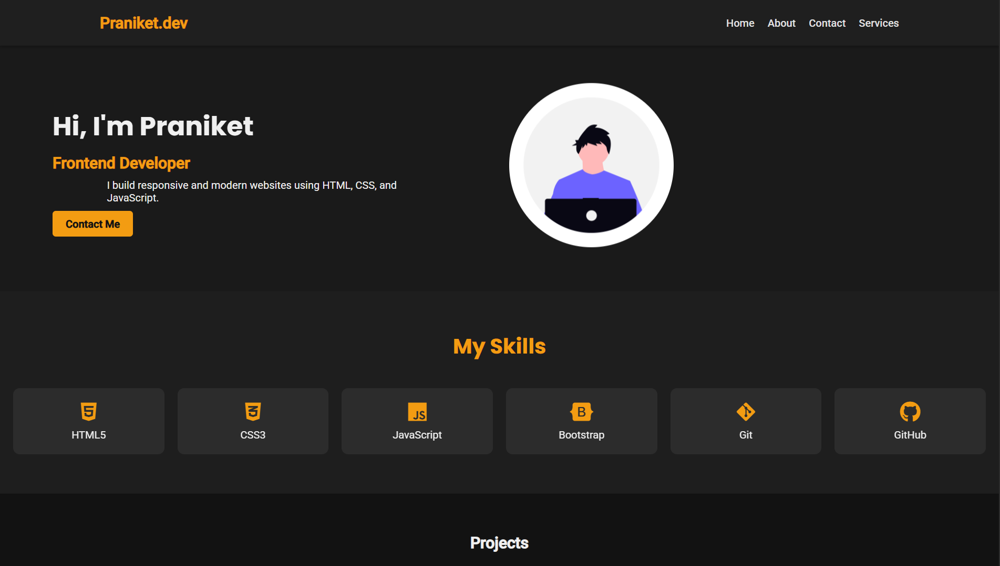
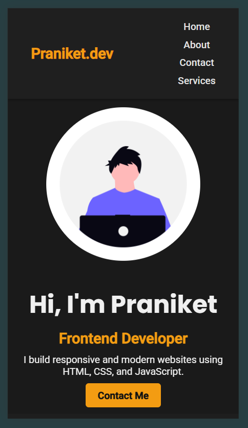

# 🌐 Personal Portfolio Website

This is a multi-page **responsive personal portfolio** website created using **HTML** and **CSS**. It includes a Home, About, Contact page. Designed to showcase personal projects, skills, and contact information.

 

---

## 🚀 Live Demo

🔗 [View Live Project](https://praniketkolte-dev.github.io/personal-portfolio/)  
*(Hosted via GitHub Pages)*

---

## 🛠️ Built With

- HTML5
- CSS3
- Flexbox & Grid Layout
- Media Queries for Responsiveness
- Font Awesome (for icons)

---

## 📁 Website Structure

- `index.html` → Home Page
- `about.html` → About Me
- `contact.html` → Contact Section
- `style.css` → Main stylesheet

---

## 📱 Responsive Design

The website is fully responsive across all device sizes:

- Desktop ✅  
- Tablet ✅  
- Mobile ✅

Built using CSS media queries and flexible units.

---

## 📸 Screenshots

| Desktop View | Mobile View |
|--------------|-------------|
|  |  |  

---

## ✨ Features

- Clean and minimal UI
- Reusable navigation bar across pages
- Well-structured code with consistent class naming
- Smooth scrolling and responsive layout
- Contact form with clean visual design

---

- ## 🧠 Learning Outcome

This project helped me:

- Practice semantic HTML structure  
- Improve layout skills using Flexbox & Grid  
- Understand responsive design deeply  
- Learn how to structure multi-page projects

